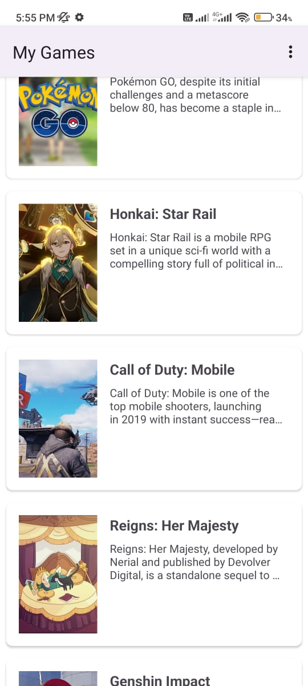
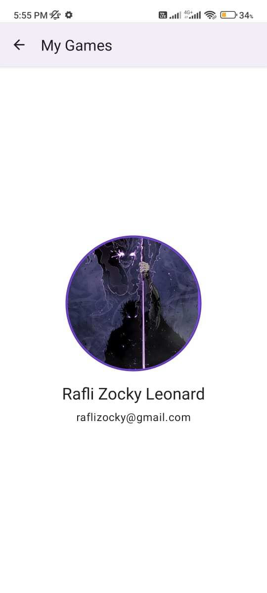

# My Games 🎮 

**My Games** is a simple Android app showcasing a collection of favorite games. 

## Demo 🪟 

    

## Setup ⚙️🛠️

| Tools                                                 | Installation                                  |
| ----------------------------------------------------- | --------------------------------------------- |
| - **Android Studio Iguana**                           | -  **Clone the Repository**                   |
| - **Gradle**                                          | - Open the Project in Android Studio          |
| - **OpenJDK**                                         | - Run the App                                 |
| - **Kotlin**                                          |                                               | 

---
